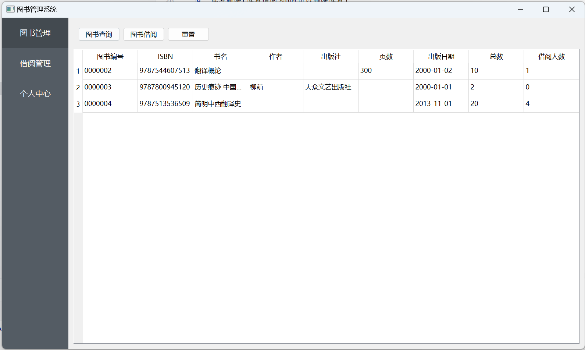

# 图书管理系统大作业

```shell
# 项目依赖 python 3.11
pip install -r requirements.txt
```
## 用户登录


## 管理员操作界面
管理员菜单分为四部分: 

1. 图书管理 
2. 读者管理 
3. 借阅管理 
4. 修改密码


### 图书管理界面功能
> 获取图书的全部信息以及该图书的总借阅人数


1. 图书查询(组合查询，书名模糊查询)
2. 图书上架(上架数量不能为空 ISBN和书名必填 如果上架的书籍ISBN在历史图书库中有信息，则会使用历史图书库中的id并删除历史图书库的记录`触发器实现`)
3. 图书修改(修改图书数量必须大于当前借阅人数，否则会提醒修改失败)
4. 图书下架(无人借阅该书籍时才可下架)
5. 重置(刷新获取全部书籍信息,用于图书查询后再获取全部书籍信息)


### 读者管理界面
> 获取读者除密码以外的全部信息以及借阅图书的总数


1. 读者添加(读者编号与姓名不能为空 如果读者编号在历史读者库中则会删除历史读者库中读者信息)
2. 读者查询(组合查询，字段可以部分为空)
3. 读者修改(可以修改读者的信息以及类型信息，选择空则删除对应信息)
4. 读者删除(读者借阅为0时可以删除读者)
5. 重置密码
6. 重置(刷新获取全部读者信息，用于读者查询后在再获取全部读者信息)


### 借阅管理界面
> 可以根据读者编号或身份证号或姓名查询读者的当前借阅书籍信息


### 修改密码界面
> 修改管理员密码


## 读者操作界面
读者菜单分为三部分: 图书管理 借阅管理 个人中心


### 图书管理
>查询图书信息以及借阅图书 



1. 图书查询(与管理员界面相同)
2. 图书借阅(借阅时需满足类型借阅要求否则借阅失败，无类型时无法借阅)
3. 重置(与管理员界面相同)


### 借阅管理
> 图书归还与余额充值


1. 图书归还(逾期会扣除余额，若余额不足则无法归还)
2. 余额充值


### 个人中心
> 个人信息显示修改，密码修改 历史借阅信息 充值扣款信息


1. 个人信息修改(只能修改姓名 身份证号 性别)
2. 修改密码(与管理员界面相同)
